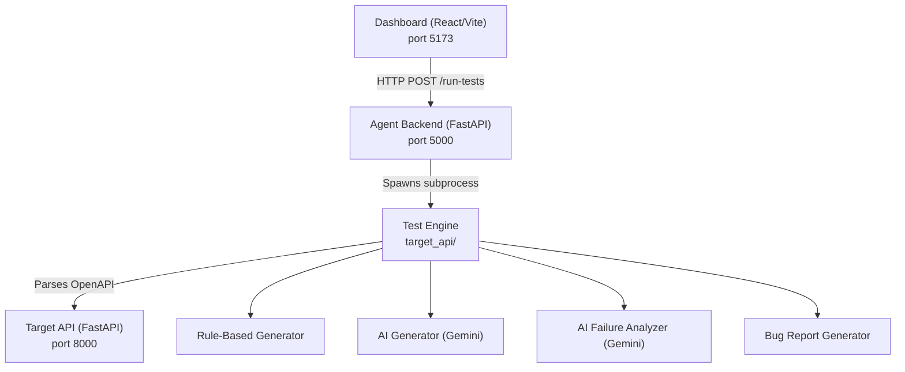

# AI API Testing Agent — Project Overview & Verification Report

## Project Architecture

## Components

| Component | Path | Port | Technology | Status |
|-----------|------|------|------------|--------|
| **Target API** | `target_api/main.py` | 8000 | FastAPI + Uvicorn | ✅ Running |
| **Agent Backend** | `agent_backend/app.py` | 5000 | FastAPI + Uvicorn | ✅ Running |
| **Dashboard** | `dashboard/src/App.jsx` | 5173 | React 19 + Vite 8 | ✅ Running |
| **Test Engine** | `target_api/` (modules) | — | Python | ✅ Functional |

---

## Dashboard Screenshot

---

## Bugs Found & Fixed

### 🐛 Bug 1 — Missing `python-dotenv` dependency
- **File:** `ai_generator/ai_test_generator.py`
- **Error:** `ModuleNotFoundError: No module named 'dotenv'`
- **Fix:** Installed `python-dotenv` via pip into the venv

### 🐛 Bug 2 — Wrong `os.getenv()` argument in AI failure analyzer
- **File:** `ai_analyzer/ai_failure_analyzer.py` (line 9)
- **Error:** The raw API key string was passed as the env var **name** to `os.getenv()` instead of `"GEMINI_API_KEY"`. This would always return `None`, breaking the Gemini client.
- **Fix:** Changed `os.getenv("AQ.Ab8...uwA5jw")` → `os.getenv("GEMINI_API_KEY")` and added `load_dotenv()` call

### 🐛 Bug 3 — UnicodeEncodeError on Windows when printing emoji responses
- **File:** `test_generator/test_executor.py` (line 155)
- **Error:** `UnicodeEncodeError: 'charmap' codec can't encode character '\U0001f916'` — Windows cp1252 console can't print emoji that AI generates in test bodies
- **Fix:** Added safe ASCII encoding with replacement chars before printing the response body

---

## Test Execution Results

**Total: 34 | ✅ Passed: 30 | ❌ Failed: 4**

### Intentional Failures (by design)
| Test ID | Endpoint | Failure Reason |
|---------|----------|----------------|
| TC-002 | `GET /health` | Returns `{"status":"error"}` — the target API intentionally has a bug here to demo detection |

### Test Ordering / State Issue (test environment bug)
| Test ID | Endpoint | Root Cause |
|---------|----------|------------|
| TC-015 | `GET /users/1` | User ID 1 was deleted by TC-021 in a prior run; in-memory DB has no persistence. Tests run sequentially and earlier tests mutate shared state |
| TC-016 | `PUT /users/1` | Same as above |
| TC-021 | `DELETE /users/1` | User ID 1 already deleted in a previous test run |

> [!NOTE]
> The TC-015, TC-016, TC-021 failures are a **test isolation problem** — the target API uses an in-memory database that gets mutated across test runs. Each test run that includes `DELETE /users/1` removes the seed data for subsequent GET/PUT tests on the same ID. This is a known architectural concern for in-memory stateful APIs.

> [!IMPORTANT]
> The `GET /health → {"status":"error"}` failure is **intentional** — it's the target bug planted for the AI to detect and analyze.

---

## AI Components

| Component | File | Model | Status |
|-----------|------|-------|--------|
| AI Test Generator | `ai_generator/ai_test_generator.py` | `gemini-3.6-flash` | ✅ Working |
| AI Failure Analyzer | `ai_analyzer/ai_failure_analyzer.py` | `gemini-3.6-flash` | ✅ Working |

**AI-Generated Tests:** 5 tests generated for `POST /users` covering boundary values, edge cases, and unicode inputs — all passed.

---

## Known Design Notes

1. **Dashboard is static** — the `App.jsx` shows hardcoded stats (34/33/1/97.1%). The `Run Tests` button does not yet call the backend `/run-tests` endpoint.
2. **Bug report IDs are always `BUG-001`** — `bug_report_generator.py` hardcodes the bug ID, so multiple failures all show as `BUG-001`.
3. **In-memory DB** — the target API resets on server restart but accumulates mutations within a run.
4. **Debug prints in parser** — `openapi_parser.py` has `print("DEBUG RESPONSE:")` lines left in production code.
